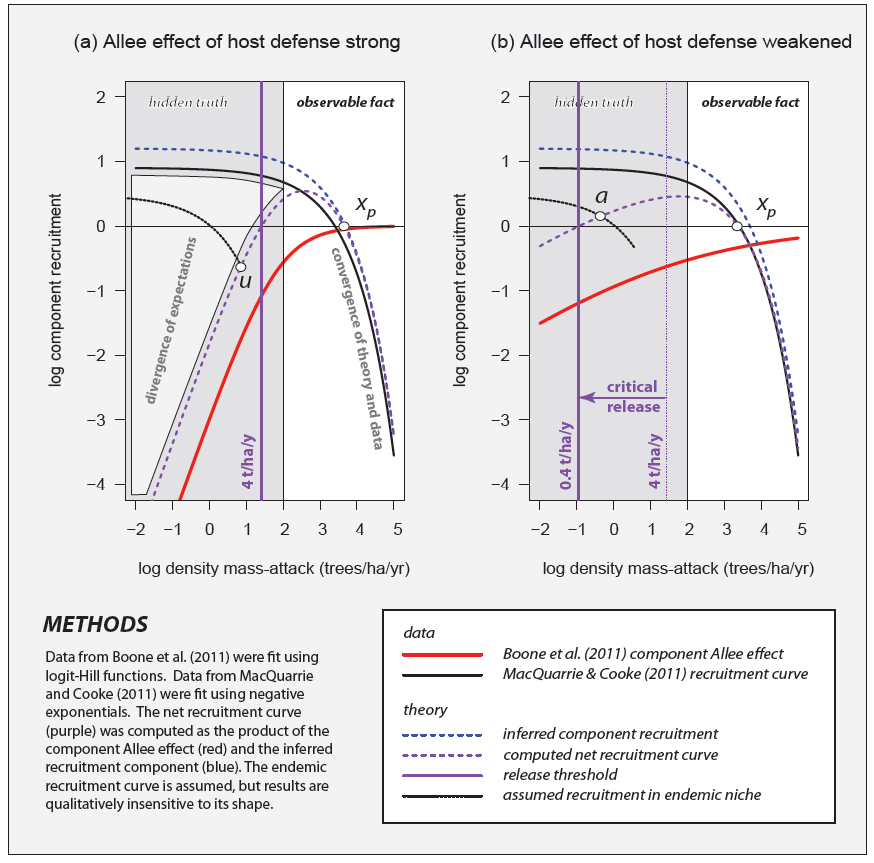

# Overview

Simulate and validate mountain pine beetle (MPB) red top growth and spread.

## Red Top Growth

Recruitment is an annual process, with the inter-annual recruitment function taking a variety of possible forms, depending who one takes as an authority on the question.
@Berryman:1979bs was an early pioneer who inspired much work in the area, and there are several possible interpretations of the data he used from Glacier and Yellowstone National Parks in Montana (MT) and Wyoming (WY) the 1960s.
Consequently, the module offers the option of using several possible interpretations (Berryman 1979 fit, Berryman 1979 forced, Boone et al. 2011 [current default]).
Additional options are forthcoming at the time of writing.

@Raffa:1983fe provided definitive laboratory proof of Berryman's [-@Berryman:1979bs] hypothesis that the recruitment curve for mountain pine beetle took the form of an inverted parabola.
There is only one Canadian field data set that captures the rising phase of recruitment, the so-called 'cooperation curve' [@Boone:2011fr].
Meanwhile, @Cooke:2017fem showed how this cooperation curve could be "hybridized"" with the down-sloping "competition curve" of @MacQuarrie:2011fr which was also derived from Rocky Mountain region field data.
If the two curves are wholly orthogonal, the parameterized up-sloping co-operation curve can be multiplied by the parameterized down-sloping competition curve, to yield a generation recruitment curve.



Box 1 is drawn from Cooke (2013) and depicts the derivation of the generation recruitment curve used as the default population growth function in our simulation model.
The base case for a well-defended pine tree is shown in panel (a).
In panel (a) the co-operation curve is steep, because the tree is well-equipped to pitch out beetles when they are attacking at low density.
When they are attacking at high density, the attack is successful and net recruitment is positive.
The red curve comes from @Boone:2011fr and relates to probability of successful colonization in early life stages post oviposition.
The black curve comes from @MacQuarrie:2011fr, and relates to the competition between late larval stages, predation during pupation, and adult female fecundity.
Panel (b) exhibits the effect of moisture stress on tree defenses, which leads to higher recruitment for low-density attacks.
This rapid transition between well-defended (a) and poorly-defended (b) pine tree is the essential seed for sudden eruption of an endemic population that subsequently rushes toward the outbreak equilibrium point $X_p$.

The dynamics of host-defense "relaxation" release are not observable in operational Aerial Detection Survey (aka "red-top") data because they occur at very low attack densities (on the order of 0.4 mass-attacked trees per hectare per year).
Hence the grayed portion of either panel, a, b.
Typically, operational survey programs are initiated only after attack densities have surpassed 5 trees per hectare.
The right-hand side of the graphs contrast that which is observable in operational data, versus the left-hand-side of the graphs (shaded), where careful observation is required.
This is why Allee effects (positive response to rising density at low density) are never observed in operational field data, as noted by @Trzcinski:2009ae, and it underscores the importance of detailed observations during the endemic stage [@Boone:2011fr].
In panel (a) host defenses are strong, leading to heavy pitch-out of adult beetles and heavy resinosis of eggs and young larvae (red curve).
As attack densities rise, the component effect of aggregative cooperation leads to higher component recruitment.
As attack densities rise further, beyond peak, overall recruitment (dashed purple) is dominated by competitive effects that arise in the late larval recruitment component (dashed blue).
In the absence of mass-immigration crossing the 4 trees/ha/y threshold, no outbreak is possible because the epidemic niche (purple) is unavailable ("u"") to MPB existing in the endemic niche (dashed black).
In panel (b), one year later, host defenses have been compromised by drought stress, the component Allee effect of host defenses weakens, recruitment rises, and the critical threshold for outbreak drops from 4 trees/ha/y to 0.4 trees/ha/year.
Now, populations in the endemic niche that were formerly incapable of mass-attacking at a rate of one tree per hectare per year may explode to a new equilibrium level, $X_p$, as the epidemic niche is now effectively available ("a").
The process of recruitment curve intersection point "u" moving from position $R < 0$ to position "a", where $R > 0$, is called a "saddle-node bifurcation" and is the formal mathematical definition of outbreak.

The purple dashed parabola in Box 1 panel (a) is the generation recruitment curve for MPB on a well-defended pine tree. 
The effect of climate warming in the cool climate of Alberta and Saskatchewan is to raise recruitment rates in a manner that is independent of attack density.
This results in a vertical shift of the generation recruitment curve (panel a):


The amount of vertical shift in MPB recruitment response to climate change is given by models of MPB climatic suitability, such that lower climatic suitability results in a downward shift of the curve, and thus a decrease in eruptive potential.

In summary, the base Boone-MacQuarrie red-top recruitment function’s behaviour is regulated by the fast variables of cooperation, competition, and sudden changes in soil moisture affecting host-tree defenses.
Weather is a fast stochastic variable affecting beetle winter and summer survival survival; however, these same processes will respond slowly to deterministic changes in climate caused by greenhouse gas concentrations.

## Red Top Spread

Spread is modeled using one of several 2D dispersal kernels, and the resulting distributions are based on the availability of pine and distance from beetle sources.
Pattern Oriented Modeling (POM; e.g., @Grimm:2005sc, @Grimm:2012pom), a heuristic optimization approach, is used to select the dispersal kernel parameters, as well as the parameters associated with asymmetric spread, based on the MPB attack data.
The POM-fit parameterization is then used for projecting MPB spread into the future.

# Usage


```r
library(SpaDES.core)

setPaths(modulePath = file.path(".."))
getPaths() # shows where the 4 relevant paths are

times <- list(start = 0, end = 10)

parameters <- list(
  #.progress = list(type = "text", interval = 1), # for a progress bar
  ## If there are further modules, each can have its own set of parameters:
  #module1 = list(param1 = value1, param2 = value2),
  #module2 = list(param1 = value1, param2 = value2)
)
modules <- list("mpbRedTopSpread")
objects <- list()
inputs <- list()
outputs <- list()

mySim <- simInit(times = times, params = parameters, modules = modules,
                 objects = objects)

mySimOut <- spades(mySim)
```

# Parameters

Provide a summary of user-visible parameters.


```
## defineParameter: '.plotInitialTime' is not of specified type 'numeric'.
```


|paramName        |paramClass |default    |min          |max         |paramDesc                                                                                                                                                         |
|:----------------|:----------|:----------|:------------|:-----------|:-----------------------------------------------------------------------------------------------------------------------------------------------------------------|
|cachePredict     |logical    |TRUE       |NA           |NA          |The function predictQuotedSpread can be Cached or not; default is TRUE                                                                                            |
|dataset          |character  |Boone2011  |NA           |NA          |Which dataset to use for stand dynamic model fitting. One of 'Boone2011' (default), 'Berryman1979_fit', or 'Berryman1979_forced'. Others to be implemented later. |
|growthInterval   |numeric    |1          |NA           |NA          |This describes the interval time between growth events                                                                                                            |
|dispersalKernel  |character  |Weibull3   |Generali.... |Exponential |This can also be a character string: one of Weibull3, GeneralizedGamma, twodt, or Exponential to use one of these different dispersal kernels.                    |
|maxDistance      |numeric    |140000     |NA           |NA          |The maximum distance to allow for pair-wise from-to dispersal pairs                                                                                               |
|quotedSpread     |language   |           |NA           |NA          |A spread function that is contained within a quote(). If left at NULL or NA, it will use the module version.                                                      |
|p_advectionMag   |numeric    |5000       |NA           |NA          |The magnitude of the wind effect on spread. This number is multiplied by the wind speed (which averages 9.6 km/h in the historical dataset)                       |
|p_meanDist       |numeric    |10000      |NA           |NA          |Expected dispersal distance (m); ~63% go less than this distance                                                                                                  |
|p_nu             |numeric    |1          |NA           |NA          |Third parameter in the generalized gamma                                                                                                                          |
|p_sdDist         |numeric    |1.2        |NA           |NA          |The dispersion term for the Weibull dispersal kernel: contributes to shape and scale parameters;sqrt(variance(of the Weibull distribution))                       |
|type             |character  |DEoptim    |NA           |NA          |One of several modes of running this module: DEoptim, optim, runOnce, validate, predict or nofit                                                                  |
|.plots           |character  |screen     |NA           |NA          |Zero or more of c('screen', 'png', 'pdf', 'raw'. See ?Plots                                                                                                       |
|.plotInitialTime |numeric    |start(sim) |NA           |NA          |This describes the simulation time at which the first plot event should occur                                                                                     |
|.plotInterval    |numeric    |1          |NA           |NA          |This describes the interval between plot events                                                                                                                   |
|.saveInitialTime |numeric    |NA         |NA           |NA          |This describes the simulation time at which the first save event should occur                                                                                     |
|.saveInterval    |numeric    |NA         |NA           |NA          |This describes the interval between save events                                                                                                                   |
|.useCache        |logical    |FALSE      |NA           |NA          |Should this entire module be run with caching activated?                                                                                                          |

# Events

Describe what happens for each event type.

## Plotting

Write what is plotted.

## Saving

Write what is saved.

# Data dependencies

## Input data

How to obtain input data, and a description of the data required by the module.
If `sourceURL` is specified, `downloadData("mpbRedTopSpread", "..")` may be sufficient.


```
## defineParameter: '.plotInitialTime' is not of specified type 'numeric'.
```


|objectName             |objectClass              |desc                                                                                                |sourceURL                                                                                                                                                                                   |
|:----------------------|:------------------------|:---------------------------------------------------------------------------------------------------|:-------------------------------------------------------------------------------------------------------------------------------------------------------------------------------------------|
|absk                   |SpatialPolygonsDataFrame |Alberta and Saskatchewan political outlines                                                         |NA                                                                                                                                                                                          |
|climateSuitabilityMaps |RasterStack              |A time series of climatic suitablity RasterLayers, each with previx 'X' and the year, e.g., 'X2010' |NA                                                                                                                                                                                          |
|massAttacksStack       |RasterStack              |Historical MPB attack maps (number of red attacked trees).                                          |NA                                                                                                                                                                                          |
|pineMap                |RasterLayer              |Percent cover maps by species (lodgepole and jack pine).                                            |NA                                                                                                                                                                                          |
|rasterToMatch          |RasterLayer              |if not supplied, will default to standAgeMap                                                        |NA                                                                                                                                                                                          |
|standAgeMap            |RasterLayer              |stand age map in study area, default is Canada national stand age map                               |http://ftp.maps.canada.ca/pub/nrcan_rncan/Forests_Foret/canada-forests-attributes_attributs-forests-canada/2001-attributes_attributs-2001/NFI_MODIS250m_2001_kNN_Structure_Stand_Age_v1.tif |
|windDirStack           |RasterStack              |RasterStack of wind maps for every location in the study area                                       |NA                                                                                                                                                                                          |

## Output data

Description of the module outputs.


```
## defineParameter: '.plotInitialTime' is not of specified type 'numeric'.
```


|objectName                        |objectClass |desc                                                                                                              |
|:---------------------------------|:-----------|:-----------------------------------------------------------------------------------------------------------------|
|massAttacksDT                     |data.table  |Current MPB attack map (number of red attacked trees).                                                            |
|massAttacksStack                  |RasterStack |This will be the same data as the inputted object, but will have a different resolution.                          |
|fit_mpbSpreadOptimizer            |list        |The output object from DEoptim                                                                                    |
|propPineRas                       |RasterLayer |Proportion (not percent) cover map of all pine. This will be the pixel-based sum if there are more than one layer |
|predictedDT                       |data.table  |Similar to massAttacksDT, but with predicted (from the models here) values of ATKTREES                            |
|thresholdAttackTreesMinDetectable |numeric     |The number of predicted attacks (post dispersal) per pixel below which it can be considered 'no attack'           |
|ROCList                           |list        |                                                                                                                  |

# Links to other modules

Part of the `LandR_MPB` Mountain Pine Beetle Red Top Model, which evaluates short-run potential for MPB establishment, eruption, and spread.

- `mpbClimateData`
- `mpbMassAttacksData`
- `mpbPine`
- `mpbRedTopSpread`

Future linkages include the `LandR` Biomass suite of modules to simulate/forecast forest vegetation dynamics, and the `fireSense` wildfire simulation model.

# References
